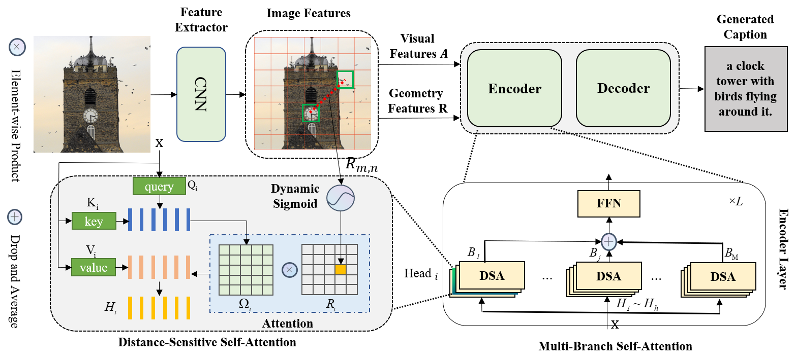

# Multi-Branch Distance-Sensitive Self-Attention Network for Image Captioning
This repository contains the reference code for the paper **"Multi-Branch Distance-Sensitive Self-Attention Network for Image Captioning"**.

***
## Experiment setup
Clone the repository and create the `MDSANet` conda environment using the `environment.yml` file:
```
conda env create -f environment.yml
conda activate MDSANet
```

Then download spacy data by executing the following command:
```
python -m spacy download en
```
***
## Training
Run `python train.py` using the following arguments:
| Argument | Possible values |
|------|------|
| `--exp_name` | Experiment name (default: MDSANet)|
| `--batch_size` | Batch size (default: 50) |
| `--workers` | Number of workers (default: 4) |
| `--head` | Number of heads (default: 8) |
| `--M` | Number of attention branches (default: 3) |
| `--p` | Drop rate of each attention branch (default: 0.4) |
| `--rl_at` | SCST starts after this epoch (default: 18) |
| `--seed` | Random seed (default: 201228) |
| `--warmup` | Warmup value for learning rate scheduling (default: 10000) |
| `--resume_last` | If used, the training will be resumed from the last checkpoint |
| `--resume_best` | If used, the training will be resumed from the best checkpoint |
| `--features_path` | Path to coco image features file |
| `--annotation_folder` | Path to folder with COCO annotations |
| `--logs_folder` | Path folder for tensorboard logs (default: "tensorboard_logs")|

For example, to train our model with the parameters used in our experiments, use
```python
python train.py --exp_name MDSANet --batch_size 50 --head 8 --M 3 --p 0.4 --features_path ./data/coco_grid_features.hdf5 --annotation_folder ./annotation --workers 4 --rl_at 18 --seed 201228
```
***
## Evaluation
Run python eval.py using the following arguments:

| Argument | Possible values |
|------|------|
| `--batch_size` | Batch size (default: 10) |
| `--workers` | Number of workers (default: 4) |
| `--features_path` | Path to coco image features file |
| `--annotation_folder` | Path to folder with COCO annotations |
| `--model_path` | Path of the model for evaluation|

## Acknowledgements
Thanks to the original [meshed-memory-transformer](https://github.com/aimagelab/meshed-memory-transformer).
